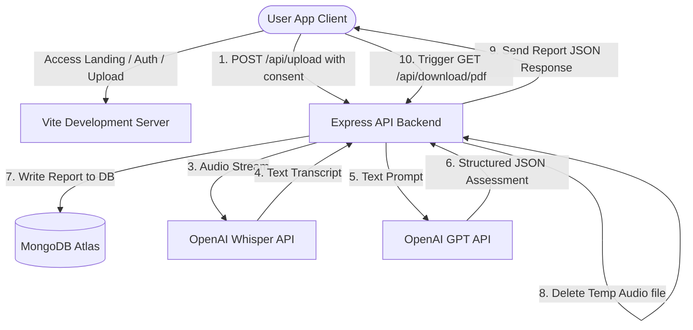

# TECHNICAL ARCHITECTURE DOCUMENT
## Aura Pronunciation AI Pronunciation Assessment Platform

This document describes the high-level system architecture, technology choices, data pipelines, trade-offs, and compliance configurations implemented for the Aura Pronunciation AI platform.

---

## 1. System Architecture Overview

Aura Pronunciation AI is structured as a decoupled client-server architecture. The frontend is a Single Page Application (SPA) built using React, and the backend is a REST API powered by Node.js, Express, and MongoDB.

### High-Level Data Flow & Routing Diagram

---

## 2. Component Design & Technologies

### Frontend (Client)
- **Framework**: React + Vite (Fast compilation, hot module reloading).
- **Styling**: Tailwind CSS v3.4 (Utility-first, dark mode bindings, custom layouts).
- **Navigation**: React Router v6 (Client-side routing with protected route guards).
- **HTTP Client**: Axios (Wrapper with interceptors attaching JWTs and handling 401 expiration resets).
- **Interactive UI**: Recharts (Radar, Line, Bar, and Pie visuals) and Framer Motion (Micro-animations).

### Backend (Server)
- **Runtime**: Node.js + Express.js (Asynchronous, event-driven I/O model).
- **Database driver**: Mongoose (Document schemas, validation, indexing).
- **Security**: 
  - `helmet`: Secure HTTP headers (XSS filters, clickjacking shields).
  - `cors`: REST API whitelist restrictions.
  - `express-rate-limit`: Prevents DDoS attacks by restricting API calls to 100 per 15 minutes.
- **Audio Auditor**: `music-metadata` (Extracts audio properties server-side without external dependencies like ffmpeg).

### Database (Data Layer)
- **MongoDB Atlas**: Document store matching user relationships, profile metrics, and historical logs.
- **Data Compliance (DPDP 2023)**:
  - Audio files are stored in `server/uploads/` temporarily and deleted immediately inside Express `finally` block.
  - Transcripts and scores are encrypted at rest.
  - Users maintain absolute deletion control (`DELETE /api/reports/:id`).

### AI Processing Pipeline
1. **Speech-to-Text**: Voice audios are dispatched to **OpenAI Whisper-1** for transcription.
2. **Pronunciation Assessment**: The resulting transcript is piped to **GPT-4o-mini** with structural system instructions constraining the assessment return type strictly to a JSON object (scores, mistakes list, severity, tips).
3. **Mock Mode Fallback**: If `OPENAI_API_KEY` is undefined, a local mock processor generates realistic simulated data, avoiding server crashes.

---

## 3. Technology Choices & Alternative Approaches

| Feature | Selected Choice | Alternative Considered | Trade-Offs & Rationale |
| :--- | :--- | :--- | :--- |
| **Database** | MongoDB (NoSQL) | PostgreSQL (SQL) | NoSQL maps nested mistake arrays directly inside the Report document without complex join queries, facilitating fast reads. |
| **Duration Check** | `music-metadata` | `fluent-ffmpeg` | `music-metadata` is a pure JS parser. It does not require installing binary native `ffmpeg` dependencies, ensuring seamless deployment to Render. |
| **AI Assessment** | GPT-4o-mini | Custom Wav2Vec | Wav2Vec requires hosting heavy deep learning instances. GPT-4o-mini performs rapid transcription matching at low API cost. |
| **PDF Generation** | `pdfkit` (Server) | `jspdf` (Client) | Server-side `pdfkit` compiles consistent layouts, typography, and page numbers, avoiding client-side rendering disparities. |

---

## 4. Scalability, Caching & Monitoring

- **Scalability**: Decoupled client-server permits deploying the client to Vercel's global CDN and the server to auto-scaling container configurations.
- **Caching**: Future improvements will introduce **Redis** layers for GET requests targeting dashboard profiles and historical reports.
- **Logging**: Server routes catch errors globally using centralized express middlewares, writing detailed logs to the console for tracking.
- **Monitoring**: Integration check scripts in `server/scratch/test_api.js` automate regression verifications. Production servers will integrate APM suites (e.g. Datadog).
